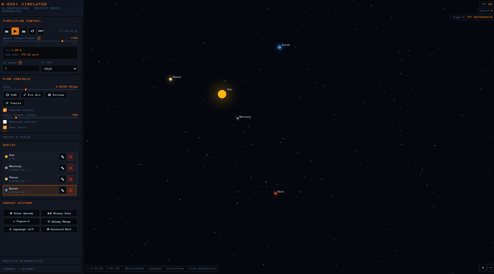

# N-Body Gravitational Simulator

> [!TIP]
> This tool is actively maintained as a private scientific utility. Feature requests and bug reports are welcome via GitHub Issues and will be reviewed within 1–3 weeks.

> [!WARNING]
> ⚠️ CAUTION: This repository contains code developed with the assistance of Artificial Intelligence (AI). While functional, AI-generated code can introduce hidden bugs, security vulnerabilities, or logic flaws that may not be immediately apparent. Please thoroughly review, audit, and test all files in an isolated development environment before deployment, as this software is provided as-is and used entirely at your own risk.

## 🚀 Introduction

N-Body Gravitational Simulator is a browser-based scientific simulation tool built as a single self-contained HTML file — no server, no login, no activity logging, no backend. It runs entirely in the browser with no external dependencies.

The simulator is built around a **Velocity Verlet** numerical integration engine — a second-order symplectic integrator that conserves energy far better than naive Euler methods. Place any number of gravitational bodies in 2D space, assign masses and initial velocities, and watch them interact under Newton's Law of Universal Gravitation in real time. The simulation supports arbitrary unit scales (meters to parsecs, kg to solar masses), logarithmic speed control spanning six orders of magnitude, orbital trail rendering, and a full import/export system for saving and sharing configurations.

It is intended as a compact, focused tool for exploring gravitational dynamics — from simple binary star systems and planetary orbits to galaxy collision simulations and three-body choreographies — entirely within the browser.

---

## 🔥 Features

A comprehensive feature set covering all major aspects of a practical 2D gravitational N-body simulation environment.

### ⚛️ Physics Engine

Full **Velocity Verlet** integration with O(n²) direct force summation. Implements Newton's Law of Universal Gravitation with optional **Plummer softening** (r_eff = √(r² + ε²)) to prevent singularities at close approach. The gravitational constant G is user-configurable. Supports **reverse time** integration — the Verlet method is time-reversible, so stepping backwards is physically meaningful.

### ⚡ Logarithmic Speed Control

A log-scale speed slider spans from 1/100× (slow motion) to 10,000× real-time through six orders of magnitude. Internally computes the optimal number of physics steps per render frame (up to 5,000) and scales the timestep accordingly, keeping total simulated time per frame exact at any speed setting. A live readout shows the current simulated time per real second (e.g. `~164 yr/s`).

### 🪐 Preset Systems

Six built-in simulation presets with physically accurate initial conditions:

| Preset | Description |
|---|---|
| ☀ Solar System | All 8 planets with real masses and circular orbital velocities |
| ★★ Binary Star | Two equal solar-mass stars in a stable circular orbit |
| ∞ Figure-8 | Chenciner–Montgomery three-body choreography (ε = 0 required) |
| ⬡ Galaxy Merge | Two toy galaxies with central black holes on collision course |
| △ Lagrange L4/5 | Sun–Earth system with stable L4 and L5 Trojan test particles |
| ◉ Asteroid Belt | Sun + Jupiter + 50 asteroid belt objects with Keplerian velocities |

### ✏️ Body Editor

A modal editor for adding or modifying any body. Supports mass, position, display radius, and color. Velocity can be entered as **X/Y components**, **magnitude + angle (polar)**, or automatically computed for a **circular orbit** around the current center of mass. A color picker with preset palette is included.

### 🖱️ Canvas Interaction

- **Double-click** empty space to add a body at that simulation coordinate
- **Click** a body to select it and view live telemetry
- **Drag** anywhere to pan the viewport
- **Scroll wheel** to zoom (centered on cursor)
- **Follow mode** — camera locks onto the selected body

### 👁️ View Controls

- Orbital trail rendering with configurable length (up to 3,000 steps), banded alpha fade, per-body color
- Adaptive **velocity vectors** (scaled to max velocity in system, always visible)
- **Acceleration vectors** (shows direction and relative magnitude of gravitational pull)
- Body **glow effect** (radial gradient halo)
- **Coordinate grid** with auto-scaling labels in chosen distance units
- Body **labels** toggle
- **Star field** background

### 📐 Units & Scale

Display units are independently configurable for distance (m, AU, light-year, parsec) and mass (kg, M☉, M⊕). All internal physics runs in SI units (meters, kilograms, seconds). G is editable for non-SI or normalized simulations.

### 📊 Physics Diagnostics

Live panel showing total energy E, kinetic energy KE, potential energy PE, energy drift percentage (quality indicator for the integrator), center-of-mass position, total momentum, and escaped body count — updated every 20 frames.

### 💾 Import / Export

Full simulation state (bodies, velocities, view, settings) serialized to JSON. Export to clipboard or file. Import by pasting JSON. Auto-save to `localStorage` with one click.

### ⌨️ Keyboard Shortcuts

| Shortcut | Action |
|---|---|
| `Space` | Play / Pause |
| `.` | Step forward one Δt |
| `,` | Step backward one Δt |
| `F` | Fit all bodies in view |
| `C` | Center on center of mass |
| `T` | Toggle orbital trails |
| `G` | Toggle coordinate grid |
| `V` | Toggle velocity vectors |
| `R` | Toggle reverse time |
| `[` / `]` | Decrease / increase simulation speed |
| `Delete` | Delete selected body |
| `Escape` | Deselect body |

---

## 🗒️ Requirements

No server-side requirements. The simulator runs entirely in the browser.

| Requirement | Value |
|---|---|
| Modern Browser (Chrome, Firefox, Edge, Safari) | Required |
| JavaScript enabled | Required |
| Internet connection | Not required |
| Screen resolution | 1280×720 minimum recommended |

---

## 🛠️ Usage

### 📄 Local File

Download `index.html` from this repository and open it directly in your browser. Everything is self-contained in that single file — no CDN, no network requests.

### 🌐 GitHub Pages

The simulator is also hosted via GitHub Pages directly from this repository. No installation required — open the link in any modern browser:

[https://bugfishtm.github.io/nbody-simulator/](https://bugfishtm.github.io/nbody-simulator/)

---

## 📁 Repository Structure

| Path | Description |
|---|---|
| .git/ | Internal file, can be ignored. |
| .github/ | Internal file, can be ignored. |
| index.html | The complete N-body simulator — single self-contained HTML file. |
| [README.md](README.md) | This readme file. |
| [LICENSE.md](LICENSE.md) | License file. |

---

## 💬 Support Channels

If you encounter any issues or have questions while using this software, feel free to contact us:

- **GitHub Issues** is the main platform for reporting bugs, asking questions, or submitting feature requests: [https://github.com/bugfishtm/nbody-simulator/issues](https://github.com/bugfishtm/nbody-simulator/issues)
- **Discord Community** is available for live discussions, support, and connecting with other users: [Join us on Discord](https://discord.com/invite/xCj7AEMmye)
- **Email support** is recommended only for urgent security-related issues: [security@bugfish.eu](mailto:security@bugfish.eu)

---

## 📢 Spread the Word

Help us grow by sharing this project with others! You can:

* **Tweet about it** – Share your thoughts on [Twitter/X](https://twitter.com) and link us!
* **Post on LinkedIn** – Let your professional network know about this project on [LinkedIn](https://www.linkedin.com).
* **Share on Reddit** – Talk about it in relevant subreddits like [r/Physics](https://www.reddit.com/r/Physics/) or [r/opensource](https://www.reddit.com/r/opensource/).
* **Tell Your Community** – Spread the word in Discord servers, Slack groups, and forums.

---

## 🌱 Contributing to the Project

Thank you for your interest in this project.

At this time, this repository is **not open for external contributions**.
Please do **not** submit pull requests or patches.

- Pull requests from external contributors are not accepted.
- Any unsolicited pull requests will be closed without review.
- All code in this repository is maintained by the project owner.
- By design, no third‑party code will be merged into this project via GitHub.

If you encounter a bug or have an enhancement suggestion, please check the "Issues" section of our GitHub repository or visit our official website for guidance before beginning any work on it.

---

## 🤝 Community Guidelines

We're focused on developing innovative solutions and advancing technology. By being part of this, you contribute to our progress.

Positive guidelines include being kind, empathetic, and respectful in all interactions. It is important to engage thoughtfully and offer constructive, solution-oriented feedback. Fostering an environment of collaboration, support, and mutual respect is essential.

Unacceptable behaviors include harassment, hate speech, or offensive language. Personal attacks, discrimination, or any form of bullying are not tolerated. Sharing private or sensitive information without explicit consent is strictly prohibited.

Together, we can partner to achieve common goals by following guidelines designed to promote effective collaboration and positive teamwork.

---

## 🛡️ Security Policy

I take security seriously and appreciate responsible disclosure. If you discover a vulnerability, please follow these steps:

- **Do not** report it via public GitHub issues or discussions. Instead, please contact the [security@bugfish.eu](mailto:security@bugfish.eu) email address directly.
- Provide as much detail as possible, including a description of the issue, steps to reproduce it, and its potential impact.

I aim to acknowledge reports within **2–4 weeks** and will update you on our progress once the issue is verified and addressed.

This software is provided as-is, without any guarantees of security, reliability, or fitness for any particular purpose. We do not take responsibility for any damage, data loss, security breaches, or other issues that may arise from using this software. By using this software, you agree that We are not liable for any direct, indirect, incidental, or consequential damages. Use it at your own risk.

---

## 📜 License Information

The license for this software can be found in the [LICENSE.md](LICENSE.md) file. The software may also include additional licensed software or libraries.

🐟 Bugfish